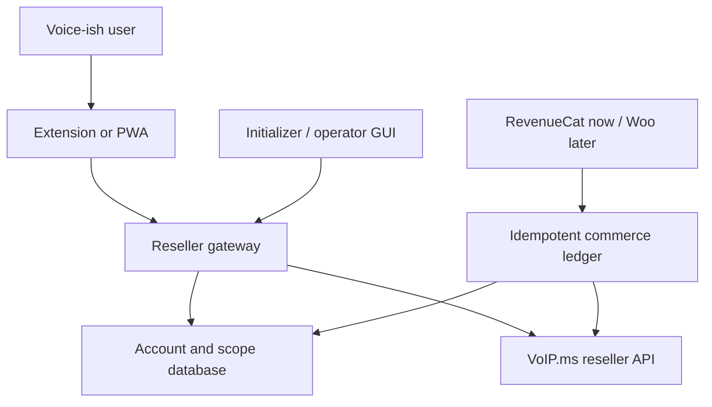

# Voice-ish reseller architecture

## Outcome

The Chrome extension and standalone/PWA expose the same customer-facing messenger. A first-launch initializer and post-install operator console own deployment setup and account mapping. The PostgreSQL-backed gateway supplies registration and sessions, maps each account to a VoIP.ms reseller client, and performs every upstream request with one protected reseller credential pair.



## Source lineages

- Extension root: `rebots-online/voipms-sms-chromex-v1.2`, version 0.2.1.
- Standalone/PWA: `rebots-online/https---forgejo.robin.mba-rcheung-voipmsish-standalone-messenger`, version 0.3.0.
- Canonical public repository: `rebots-online/voipms-sms-chromex` (currently reached through the historical `voipms-sms-chromex-v1.2` name), version 0.5.0.

The canonical repository keeps both working clients and adds the reseller gateway rather than choosing one ancestor and losing the other.

## Authority and vocabulary

| Customer-facing concept | Internal/upstream representation |
|---|---|
| Account or organisation | `tenants` + VoIP.ms reseller client |
| Person who signs in | `app_users` + `tenant_memberships` |
| Phone number | VoIP.ms DID + `voipms_dids` ownership row |
| Phone or line | VoIP.ms subaccount + `voipms_subaccounts` |
| Plan | VoIP.ms reseller package / local entitlement |
| Service credit | VoIP.ms reseller-client virtual balance |
| Call history | Reseller-scoped CDR |

The application UI does not ask customers to understand DID, subaccount, POP, rate deck, CDR, or master API terminology.

## Request boundary

The browser sends only:

```json
{
  "method": "sendSMS",
  "params": {
    "did": "6135550100",
    "dst": "6135550101",
    "message": "Hello"
  }
}
```

The gateway:

1. authenticates the Voice-ish bearer session;
2. resolves its account and `reseller_client_id`;
3. rejects unapproved methods and reserved fields;
4. validates a sending DID against `voipms_dids`;
5. injects `client=<mapped reseller client>`;
6. injects the server-only `api_username` and `api_password`;
7. calls VoIP.ms and filters DID-bearing response collections to the mapped account.

The initial compatibility allow-list is `getDIDsInfo`, `getSMS`, `getMMS`, `getMediaMMS`, `sendSMS`, `sendMMS`, `getSubAccounts`, `getResellerBalance`, and reseller CDR.

## Registration and provisioning

Registration is local and safe:

```text
register → user + account + owner membership + session
         → pending reseller mapping
         → payment/package/address policy
         → administrator or durable job provisions VoIP.ms
         → active mapping + allowed DIDs/subaccounts
```

The installer creates the first user as a platform operator. After installation, `/admin/` uses an ordinary revocable Voice-ish session plus the platform-admin flag; it never receives the internal administrator token. It lists pending tenants and maps a selected account to its reseller-client ID, DIDs, and subaccounts.

Automatic VoIP.ms signup is intentionally outside this baseline. The schema already includes idempotent `provisioning_jobs` so it can be introduced without changing client authentication.

## Initialization boundary

Before configuration exists, the launcher binds the initializer to `127.0.0.1` only, creates a 256-bit one-time token, and opens the setup URL with that token in the browser fragment. The GUI moves it to session storage and removes the fragment from browser history. Every mutating setup request requires the token.

Successful initialization:

1. validates public URLs and requires HTTPS for non-local service/application origins;
2. tests the PostgreSQL and VoIP.ms connections;
3. applies checksum-tracked migrations;
4. creates and promotes the first operator;
5. optionally maps the first reseller client transactionally;
6. creates the service-only administrator token;
7. atomically writes `.voiceish/config.json` with owner-only permissions;
8. closes the initializer listener and starts the runtime on the configured interface.

The configuration file is never served. A second initialization attempt is rejected once it exists. Unattended deployments may supply the equivalent environment variables; migrations are still applied on every runtime start.

Every future commerce or gateway adapter—including RevenueCat, WooCommerce, ACP, x402, Android gateways, and GSM hardware—must contribute its configuration and verification stage to this initializer/operator surface. An adapter is not considered integrated if its required setup exists only as environment variables or README commands.

## Commerce seam

RevenueCat and WooCommerce are payment/event sources, not the customer database. Both map to the same tenant through `billing_identities` and land webhook/order identifiers in `commerce_events` before any entitlement or credit mutation.

`credit_ledger` is the immutable bridge:

- a unique provider event is recorded once;
- a credit/top-up becomes a pending ledger row;
- one durable provisioning action applies it upstream;
- the upstream reference is stored;
- retries do not double-credit;
- refunds and reversals get distinct ledger entries.

This permits RevenueCat to provide the day-one paywall while the tailored WooCommerce integration is built against the same stable seam and phased in before the free band ends.

## Canonical records

| Concern | Canonical record |
|---|---|
| Login, memberships, session revocation | Voice-ish PostgreSQL |
| RevenueCat/Woo customer association | `billing_identities` |
| Purchase event idempotency | `commerce_events` |
| Entitlement projection | `entitlements` |
| Credit handoff and reversals | `credit_ledger` |
| Provisioning state and retries | `provisioning_jobs` |
| Upstream phone configuration and virtual balance | VoIP.ms |
| Local authorization to DIDs/subaccounts | Voice-ish mapping tables, reconciled with VoIP.ms |

## Operational requirements

- Terminate TLS before exposing the gateway beyond localhost.
- Keep the `.voiceish` state directory owner-readable; unattended deployments should put the VoIP.ms credential pair and `VOICEISH_ADMIN_TOKEN` in a secret manager.
- Configure VoIP.ms API source-IP allow-listing for the gateway host, not end-user devices.
- Restrict `VOICEISH_ALLOWED_ORIGINS` to exact deployed clients.
- Run session cleanup, mapping reconciliation, and commerce/provisioning workers on a schedule.
- Do not log request bodies: MMS data URLs, message bodies, tokens, and upstream credentials are sensitive.
