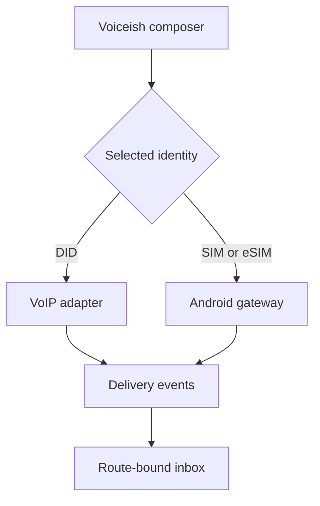
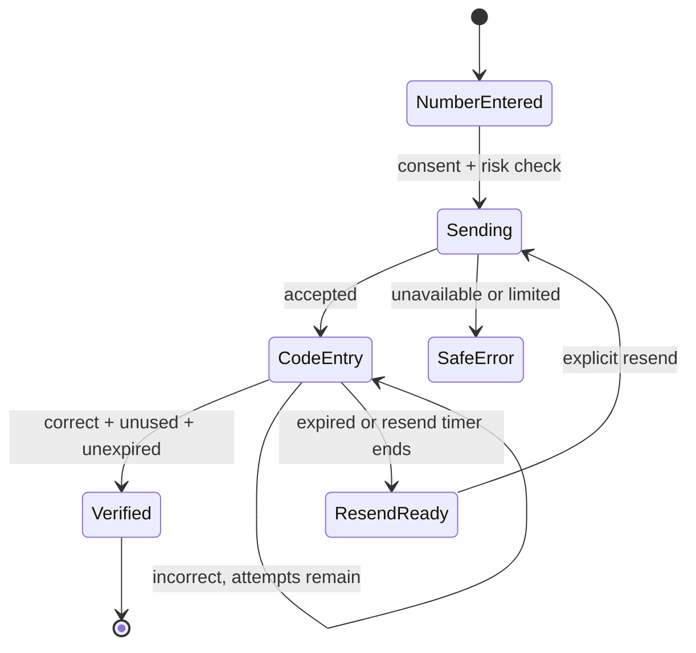
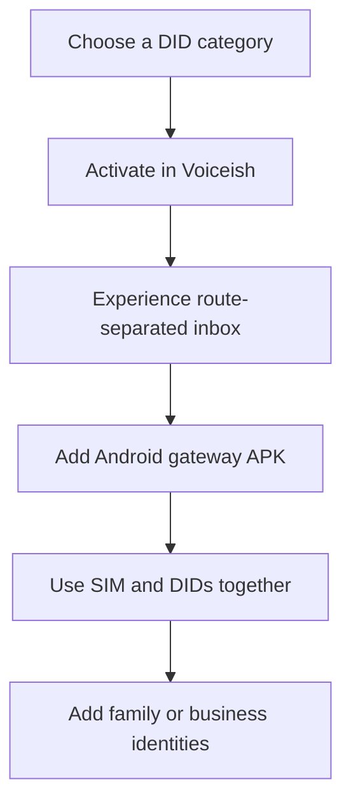
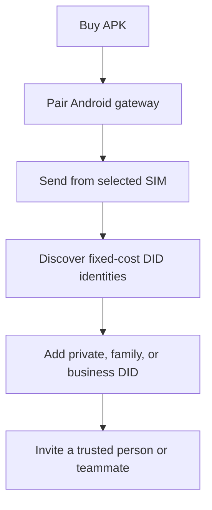

# Condone Numbers + Voiceish

## Product requirements document — discussion draft

**Version:** 0.1.0  
**Date:** 2026-08-20  
**Status:** For product, architecture, compliance, pricing, and visual-direction decisions  
**Working name:** Condone Numbers  

> A route-explicit communications system that lets a person or small team use VoIP DIDs and Android SIM/eSIM identities from one Voiceish inbox—without a platform-side per-message meter and without silently sending from the wrong number.

## 1. Decision summary

Build a native Android sideload app plus a hosted control plane and Voiceish clients. The Android app is a secure SIM/eSIM gateway and, when the user opts in, a default SMS app. Voiceish is the customer-facing inbox and calling/messaging surface. A VoIP.ms adapter supplies DID-based messaging. Every message is bound to an explicit route tuple:

`transport + local identity + remote identity`

The system must never silently fall back from a selected DID or SIM to another identity.

Commercially, the product has two complementary entry points:

- **Come for a number:** buy an inexpensive DID for a private, family, personal, or business identity; discover Voiceish and the Android gateway.
- **Come for the app:** buy the sideload APK to avoid an app-side per-message charge; discover inexpensive DIDs for additional identities and people.

The honest promise is **“no app-side per-message meter.”** Carrier charges, carrier policies, fair-use constraints, taxes, number rental, and third-party fees still apply.

## 2. Problem and opportunity

People often have several communication identities but fragmented tools: a personal SIM, a business eSIM, a family DID, a private number, and a browser extension. Existing SMS gateway products demonstrate demand for connecting Android numbers to APIs, webhooks, CRM workflows, and a web inbox. They also expose a set of recurring weaknesses:

- brittle permission and default-SMS-app onboarding;
- unclear route selection and dangerous fallback behavior;
- credentials stored in clients or communicated unclearly;
- deliverability claims that exceed the available evidence;
- confusing “unlimited” language that obscures carrier limits;
- SMS verification flows with too little abuse protection and too much implementation ambiguity;
- per-message platform economics that are unattractive for local-first users.

Condone Numbers can win through route clarity, implementation quality, security, explainable readiness controls, and a visually distinctive Voiceish experience.

## 3. Goals and non-goals

### Goals

1. Send and receive SMS through an Android SIM/eSIM identity from Voiceish, APIs, and approved automations.
2. Send and receive supported messaging through VoIP DIDs in the same inbox.
3. Preserve the selected local identity end-to-end and make it visible before, during, and after every send.
4. Provide a robust verification-code API and a safe, low-friction end-user verification experience.
5. Support family, private, personal, and business number categories without mixing histories or routes.
6. Provide useful delivery guardrails without claiming that synthetic traffic creates carrier reputation.
7. Support a one-time APK purchase, plus optional fixed-price hosted service and recurring DID service.
8. Give the Android and SaaS surfaces a shared, memorable “signal observatory” visual system.

### Non-goals for v1

- pretending a consumer mobile plan is an unrestricted A2P channel;
- bypassing carrier filtering, consent law, plan restrictions, or platform rules;
- synthetic peer-to-peer “warming” traffic;
- silent route substitution;
- iMessage automation;
- a full contact-center suite;
- guaranteed MMS interoperability through every carrier/device combination;
- Play Store distribution at initial launch.

## 4. Users and jobs

| User | Primary job | Success signal |
|---|---|---|
| Privacy organizer | Separate marketplaces, family, personal, and private conversations | Correct identity is obvious; no accidental cross-send |
| Small-business owner | Use an existing phone plan and DIDs from one desktop inbox | Fast setup, reliable replies, predictable fixed costs |
| Family administrator | Give relatives categorized numbers without another complex app | Simple invitations, clear ownership, safe delegation |
| Developer/SaaS operator | Add transactional SMS and verification with APIs/webhooks | Idempotent APIs, observable delivery, abuse controls |
| Reseller/operator | Sell and support DIDs and hosted relay service | Easy provisioning, margin visibility, low support burden |

## 5. Product model

### Core entities

- **Workspace:** billing, policy, users, integrations.
- **Person:** a human with roles and devices.
- **Identity:** a DID, SIM, or eSIM that can be selected as the local address.
- **Route:** a transport bound to a local identity and remote identity.
- **Conversation:** messages grouped only when the complete route key matches.
- **Android gateway:** a registered Android device with one or more subscriptions.
- **Voiceish client:** browser extension, web/PWA, desktop shell, or Android UI.
- **Consent record:** source, purpose, timestamp, proof, jurisdiction, and revocation state.
- **Delivery event:** queued, accepted locally, submitted, delivered when available, failed, or unknown.
- **Readiness policy:** caps, quiet hours, country allowlist, canary settings, cool-downs, and stop rules.

### Conversation invariant

Two messages are in the same conversation only if their local identity and remote identity match. A SIM conversation and DID conversation with the same person remain distinct unless the user explicitly links their display, never their send route.



## 6. Scope and release sequence

### Release A — trustworthy core

- Android QR pairing with signed, single-use enrollment token.
- Subscription discovery and friendly SIM/eSIM naming.
- SMS send using the explicitly selected subscription.
- Inbound SMS receipt when platform role/permissions allow it.
- Default-SMS-app readiness test and guided recovery.
- Voiceish unified inbox with route badges and route lock.
- VoIP.ms DID discovery, send, history, and reply pinning.
- API keys, idempotent send API, delivery webhooks, inbound webhooks.
- Consent ledger, STOP handling, allowlists, route caps, quiet hours.
- Route Readiness panel with evidence and plain-language limits.
- Verification-code send/check API.

### Release B — richer messaging and teams

- MMS in default-messenger mode after device/carrier compatibility testing.
- Team roles and route-level permissions.
- Contact tags, saved segments, approved low-volume outreach.
- CRM/no-code connectors using the public API.
- Self-hosted relay option and signed update channel.
- DID ordering, porting handoff, emergency-address warnings where applicable.

### Release C — scale selectively

- Multi-region relay and higher availability.
- Queue partitioning and streaming infrastructure only when measured load requires it.
- Reseller console, branded workspaces, pooled support tools.
- Formal experiments on legitimate progressive ramping, segmented by carrier and plan type.

## 7. Android experience

### Modes

**Companion mode** supports explicit outbound SMS through `SmsManager` and captures inbound messages only where Android permissions and platform behavior allow. It is the lowest-commitment onboarding path.

**Default messenger mode** is required for a complete inbox and MMS handling. The app requests the default SMS role through the platform-supported flow, explains the consequence before the system prompt, and provides a reversible exit.

### Permission ladder

1. Explain the outcome in plain language.
2. Ask for one permission or role at the moment it becomes necessary.
3. Run a capability test after each grant.
4. Show the exact missing capability rather than “something went wrong.”
5. Offer device-specific settings guidance only after a failed test.
6. Never imply that a granted permission guarantees carrier delivery.

### Device state model

`Unpaired → Paired → Capability check → Route ready → Degraded → Paused/Revoked`

The app reports battery restrictions, background connectivity, active subscriptions, default-role state, last heartbeat, last successful send, and last inbound observation. It must not label a route “healthy” merely because the socket is connected.

## 8. Verification flow

### End-user wording

**Phone entry**  
“Enter the mobile number you can access now. We’ll send one text with a 6-digit code. Message and carrier rates may apply.”

**Code entry**  
“Enter the 6-digit code sent to ••• ••• 0142. It expires in 5 minutes.”

**Resend timer**  
“You can request another code in 24 seconds.”

**Incorrect code**  
“That code doesn’t match. Check the newest message and try again.”

**Expired code**  
“That code has expired. Request a new one to continue.”

**Rate limited**  
“We can’t send another code right now. Wait a little and try again.”

**Route unavailable**  
“This number can’t receive a code from the selected route right now. Choose another verified method or try later.”

Avoid revealing whether an account exists. Avoid “invalid user,” carrier-specific blame, or countdown resets that encourage repeated sends.

### Server requirements

- CSPRNG-generated six-digit code; never derived from user data.
- Store only a keyed hash with tenant-scoped context; never log or return the code after creation.
- Default expiry 5 minutes; one-time atomic consumption.
- Maximum 5 verification attempts per issued challenge.
- Resend delay 30 seconds; default maximum 5 sends per number per hour.
- Layered limits by tenant, number, IP, device, route, and risk signal.
- Idempotency key for the send request and stable challenge identifier.
- New send invalidates prior active codes unless a product-specific grace rule is documented.
- Constant-time comparison after normalized input validation.
- Generic public errors; detailed internal reason codes with redaction.
- Webhooks contain challenge ID, status, timestamps, and route—not the code.
- Audit trail for configuration changes and API-key actions.
- Optional fallback methods must be verified independently; do not automatically reroute a code through a different identity.



## 9. Warming feature: evidence and product decision

### What TextLink describes

TextLink markets a built-in SMS warmup in which new SIMs ramp activity over roughly 21 days. Its FAQ describes gradual daily volume intended to mimic natural behavior. In public AppSumo answers, the founder described devices texting one another to increase carrier reputation and, in an earlier answer, sending at intervals intended not to alert carriers.

These statements establish the feature’s intent and mechanism. They do **not** establish its effectiveness.

### What the research found

No public controlled study, carrier validation, or independently audited dataset was found showing that synthetic SIM-to-SIM messaging improves mobile-network “trust,” long-term deliverability, or account survival. The closest mature analogy—dedicated email IP warmup—belongs to a different network, identity, and reputation system and cannot be treated as evidence for consumer SIM messaging.

Carrier and industry guidance points in the opposite direction on the underlying risk:

- CTIA principles distinguish application-to-person messaging from typical human operation and emphasize protection against unwanted or high-volume traffic.
- T-Mobile’s terms prohibit spam, unsolicited or mass automated communications, certain unattended machine-to-machine uses, and resale unless a plan allows it.
- Verizon describes consumer email-to-text as a low-volume consumer service rather than an A2P channel and separately restricts broadcast/telemarketing-like use.
- Rogers states that network scanning continuously detects and filters unwanted messages.
- U.S. FCC and Canadian CASL rules impose consent requirements; CASL also requires identification and a working unsubscribe mechanism for commercial electronic messages.

Public user discussions also expose operational ambiguity: carrier metering and flagging concerns, inbound recognition problems tied to default-SMS behavior, and support/activation friction. Anecdotes are useful for identifying failure modes, not for measuring success rates.

### Assessment

| Claim | Evidence level | PRD treatment |
|---|---|---|
| A conservative ramp reduces sudden queue spikes | Mechanistically plausible | Use as a reliability control |
| A conservative ramp may reduce abrupt-volume anomaly | Plausible but carrier-specific | Test carefully; no guarantee |
| Synthetic chats build carrier trust | Unsupported by controlled evidence found | Do not claim or implement |
| Warming makes A2P traffic compliant | False category error | Explicitly reject |
| Warming prevents suspension | Unsupported and contradicted by plan discretion | Never promise |

### Product decision: Route Readiness, not fake warming

Condone Numbers will not generate reciprocal synthetic chats. Instead, it will provide **Route Readiness**, an explainable operational control set:

- user attestation that the carrier plan and intended use are permitted;
- consent source and proof for every recipient list;
- automatic STOP/opt-out enforcement;
- conservative default route caps and adjustable pacing;
- country allowlist and quiet hours;
- small canary batches using real, opted-in or internal test traffic;
- cool-down after failure spikes, complaints, or missing device heartbeats;
- clear accepted/delivered/failed/unknown distinctions;
- a readiness explanation that lists evidence, missing checks, and last observation;
- fail closed when route identity, permission state, consent, or policy is uncertain.

The readiness score is an internal product heuristic, never described as a carrier reputation score.

### Proposed effectiveness study

Any future ramping experiment must use legitimate, consented traffic and approved plans. Randomize comparable routes between a fixed conservative cap and progressive ramp; stratify by carrier, device, plan type, country, and use case. Measure submission acceptance, delivery signals where available, failures, opt-outs, complaints, and suspensions. Pre-register stop rules. Do not deliberately violate plan terms, fabricate consumer conversations, or interpret absence of a block as proof of deliverability.

## 10. Voiceish and visual experience

### Design thesis: signal observatory

The product should feel like an elegant communications instrument, not a generic CRM. Use midnight ink surfaces, restrained glass layers, warm copper/gold for identity, electric cyan for live transport, and compact signal traces. Every decorative signal must correspond to useful state.

### SaaS command center

- top identity rail: DIDs, SIMs, and eSIMs grouped by Personal, Family, Private, and Business;
- center conversation stage with persistent “Sending from” route lock;
- left inbox grouped by identity, never by contact alone;
- right Route Readiness inspector: role, heartbeat, consent, cap, last accepted send, last inbound event, and current blockers;
- delivery event drawer with human-readable state transitions;
- usage card that says “No app-side per-message meter” and itemizes external costs.

### Android gateway

- large selected-identity card with carrier, subscription name, and mode;
- four-state readiness orb: ready, attention, paused, offline—always paired with text;
- guided capability checks rather than a wall of permissions;
- local outbox and event timeline;
- explicit pause relay and revoke-device controls;
- discreet privacy mode that hides message previews while preserving route status.

### Accessibility and motion

- WCAG-aligned contrast; color never carries status alone;
- 48dp Android targets and full keyboard paths on web/desktop;
- reduced-motion mode;
- motion communicates route selection, queue progress, or state change only;
- content remains usable at 200% zoom and with large Android fonts.

## 11. Customer workflows

### DID-first flywheel



### APK-first flywheel



## 12. Recommended architecture

### Android

- Kotlin, Jetpack Compose, Coroutines/Flow.
- `SmsManager` scoped to the selected subscription for outbound SMS.
- `RoleManager` and the documented default-SMS role flow for complete messaging behavior.
- Room for local event/message state; DataStore for preferences.
- Android Keystore-backed key material and application-layer encryption for sensitive local data.
- WorkManager for bounded deferred work, not as a permanent socket substitute.
- A foreground service only when user-enabled behavior and Android service-type rules require it; avoid modeling an always-on gateway as a `dataSync` service because recent Android versions impose time limits.
- Signed app releases, reproducible build metadata, in-app update verification, and rollback-safe schema migration.

### Control plane

- TypeScript on current Node LTS with Fastify and OpenAPI 3.1.
- PostgreSQL as system of record; row-level tenant boundaries in application and database design.
- Redis for bounded rate limits, short leases, and idempotency assistance—not message truth.
- Transactional outbox workers initially; introduce a streaming broker only after measured operational need.
- WebSocket or server-sent event channel for clients; authenticated HTTPS for device commands and receipts.
- Per-device asymmetric key pair established during QR pairing; single-use, short-lived enrollment token.
- Structured redacted logs, traces, delivery-event audit, and webhook replay tools.

### Voiceish clients

- React and TypeScript shared UI domain packages.
- PWA/web surface plus the existing MV3 extension adapter.
- Optional Tauri 2 desktop shell after web flows stabilize.
- Generated API clients and shared route/status vocabulary.

### Adapter boundary

- Android SIM/eSIM adapter.
- VoIP.ms DID adapter.
- Future providers must implement the same capabilities, events, idempotency, and route-identity contract.
- Master reseller/provider credentials remain server-side. Users authenticate to Condone/Voiceish, not to a shared provider credential.

### Why not a cross-platform Android shell

The gateway depends on subscription-aware telephony APIs, the default SMS role, broadcast handling, background execution policy, Keystore, and device-specific diagnostics. A native Android implementation reduces plugin risk and makes platform-state failures explainable.

### Phone intelligence and trusted-calling provider strategy

“HLR lookup,” CNAM, number registration, and STIR/SHAKEN solve different problems:

- **HLR / number intelligence:** line type, current carrier, porting, reachability/roaming where permitted, and sometimes SIM-swap signals.
- **CNAM lookup:** reads a caller-name record, principally useful in the US/Canada and not guaranteed to be present or current.
- **Outbound CNAM registration:** submits a short business name to the relevant database for an owned number; display is determined downstream.
- **STIR/SHAKEN:** cryptographically signs voice calls and conveys how strongly the originating provider can attest to the caller’s right to use the number. It does not apply to SMS and does not guarantee removal of a spam label.
- **Branded calling / reputation registration:** registers business identity, number, logo, or call reason with mobile display and analytics ecosystems. It is distinct from CNAM and STIR/SHAKEN.

| Provider | Best fit | Confirmed public capabilities relevant here | Product note |
|---|---|---|---|
| Telnyx | Developer-first consolidated carrier | DIDs, voice/messaging, HLR-derived lookup, carrier/line type/LRN/ported status/CNAM, outbound CNAM, STIR/SHAKEN | Strong technical benchmark and likely first comparison to VoIP.ms |
| Bandwidth | US carrier-grade / reseller and higher-scale voice | DIDs/messaging/voice, CNAM per-dip, caller-name services, STIR/SHAKEN and hosted signing for qualified service providers | Strong when Condone becomes a voice-service provider or needs direct carrier operations |
| Twilio | Fastest broad CPaaS integration and Trust Hub workflow | Lookup/line type/caller name, DIDs/voice/messaging, CNAM registration, STIR/SHAKEN, Voice Integrity, branded calling | Excellent workflow/reference implementation; typically not the lowest-cost resale layer |
| Sinch | Global enterprise messaging and identity | Number lookup with carrier/line/fraud signals, SIM-swap capabilities, voice, CNAM, STIR/SHAKEN | Good global shortlist; commercial access and coverage need confirmation |
| Infobip | Global HLR-derived lookup and messaging | HLR-derived number lookup, porting, roaming, validity/error information, optional SIM-swap data | Strong specialized lookup candidate; packages and country coverage vary |
| Vonage | Reachability/roaming and identity signals | Number Insight / Identity Insights, mobile network, validity, porting, reachability where available, roaming, SIM-swap/subscriber-match direction | Plan against the announced transition from Number Insight to Identity Insights |
| VoIP.ms | Current low-cost DID entry and existing Voiceish adapter | US/Canada DIDs, SMS/MMS on eligible numbers, inbound CNAM lookup, support-assisted outbound CNAM update on eligible US DIDs, incoming attestation-aware filtering | Retain as initial DID adapter; verify STIR/SHAKEN attestation behavior and reseller terms contractually |
| Hiya / First Orion / TNS | Mobile caller display, reputation registration, and remediation | Business-number registration, reputation signals, branded calling; Free Caller Registry distributes registrations to these analytics engines | Add only for voice launch; registration does not guarantee label removal |

Recommended implementation:

1. Create a provider-capability registry rather than embedding provider assumptions in product logic.
2. Keep VoIP.ms as the first DID adapter because the supplied Voiceish implementation already integrates it.
3. Pilot Telnyx Lookup and Infobip or Vonage as two materially different number-intelligence sources; compare coverage, latency, data freshness, privacy terms, and cost with a fixed test set.
4. If native outbound voice becomes a launch feature, run a commercial/RFP comparison among Telnyx, Bandwidth, and Twilio for number ownership, attestation level, reseller/KYC flow, CNAM registration, branded calling, emergency calling, and porting.
5. Treat the originating voice carrier as the attestation authority. A STIR/SHAKEN registration at one provider does not authenticate a call originated through an unrelated provider.
6. Cache lookup results by field-specific freshness, record provenance and observation time, and return `unknown` rather than inventing certainty.
7. Require a documented permitted purpose and retention policy for HLR, SIM-swap, identity-match, or subscriber data.

## 13. API outline

```text
POST /v1/devices/enrollment-tokens
POST /v1/devices/{deviceId}/complete-enrollment
GET  /v1/identities
GET  /v1/routes/{routeId}/readiness
POST /v1/messages
GET  /v1/messages/{messageId}
POST /v1/verification/challenges
POST /v1/verification/challenges/{challengeId}/check
POST /v1/webhook-endpoints
POST /v1/consents
POST /v1/consents/{consentId}/revoke
```

Every message creation request includes `routeId`, `to`, content, and `Idempotency-Key`. A request without an available selected route fails; it never changes transport or identity automatically.

## 14. Security, privacy, and abuse prevention

- explicit data-retention controls by message class;
- encryption in transit and at rest, with device key revocation;
- minimum viable message content in logs;
- API keys displayed once, scoped, rotatable, and auditable;
- webhook signing, timestamp tolerance, replay protection;
- role-based access down to identity/route;
- rate limits and abuse signals independent of billing limits;
- consent and opt-out enforcement before queue insertion;
- export/delete workflows and documented backup boundaries;
- support tooling that defaults to metadata rather than content;
- no security claim based solely on “local storage.”

## 15. Business model

| Offer | Commercial shape | Customer promise |
|---|---|---|
| Gateway APK | One-time license per household/device pack | Native Android gateway; no app-side per-message meter |
| Hosted control plane | Fixed monthly tiers by workspace/device/support level | Managed relay, sync, webhooks, backups, updates |
| DID service | Recurring number rental and optional usage pass-through | Categorized identities integrated into Voiceish |
| Self-host option | Higher one-time or annual maintenance license | Customer-operated relay with signed updates |

A one-time APK price is sustainable only if expensive shared infrastructure is optional or separately priced. The pricing page must itemize what is included and distinguish platform fees from carrier/provider charges.

## 16. Metrics

### Activation

- pairing completion rate;
- median time to first successful test send;
- percent of users who understand companion vs default mode;
- recovery rate after a failed inbound capability test.

### Trust and reliability

- wrong-route sends: target zero;
- percentage of message attempts with explicit route and consent decision;
- event-state completeness;
- duplicate sends prevented by idempotency;
- verification completion, resend, expiry, and abuse-block rates;
- time to explain and resolve a degraded route.

### Business

- DID-first to APK conversion;
- APK-first to DID conversion;
- paid workspace attachment;
- support contacts per activated gateway;
- gross margin by offer, excluding pass-through fees.

## 17. Acceptance criteria for v1

1. A user can pair one Android gateway and name each active subscription.
2. A test send from each selected route arrives with the expected originating identity.
3. Inbound capability is verified by a real test; unsupported state is shown clearly.
4. The composer always displays and locks the local identity before send.
5. A disconnected or unauthorized route fails closed without fallback.
6. Duplicate idempotency keys do not create duplicate sends.
7. Verification codes expire, are single-use, and respect configured attempt/send limits.
8. STOP immediately suppresses further commercial messages for that purpose.
9. Route Readiness shows its evidence and never claims carrier reputation.
10. All price copy says “no app-side per-message meter” and discloses external costs.
11. Device revocation prevents subsequent command acceptance.
12. Accessibility checks cover keyboard, screen reader labels, contrast, font scaling, and reduced motion.

## 18. Decisions required

1. Product name: retain Condone Numbers, lead with Voiceish, or create a new gateway sub-brand?
2. v1 distribution: direct APK only, managed-device channel, or both?
3. Default messenger: optional advanced mode or required for full activation?
4. Hosted service boundary: which features remain local after a one-time APK purchase?
5. DID geography and reseller/provider scope at launch.
6. MMS: launch requirement or compatibility-tested Release B item?
7. Data retention defaults for family, personal, and business workspaces.
8. Visual direction approval: “signal observatory” as the shared Android/SaaS system.

## 19. Research sources

### TextLink product and documentation

- https://docs.textlinksms.com/
- https://docs.textlinksms.com/dashboard
- https://docs.textlinksms.com/chat-app
- https://docs.textlinksms.com/api
- https://docs.textlinksms.com/webhooks
- https://docs.textlinksms.com/gohighlevel
- https://docs.textlinksms.com/zapier
- https://docs.textlinksms.com/make
- https://docs.textlinksms.com/team
- https://docs.textlinksms.com/imessage
- https://textlinksms.com/how-textlink-works
- https://textlinksms.com/faq
- https://textlinksms.com/pricing
- https://textlinksms.com/verificationapi
- https://textlinksms.com/recommended-setup

### Carrier, industry, and law

- https://api.ctia.org/wp-content/uploads/2023/05/230512-CTIA-Messaging-Principles-and-Best-Practices-FINAL.pdf
- https://www.t-mobile.com/responsibility/legal/terms-and-conditions
- https://www.verizon.com/support/email-to-text-faqs/
- https://www.verizon.com/support/important-plan-information/
- https://www.rogers.com/support/mobility/prevent-unsolicited-or-nuisance-calls-and-texts
- https://crtc.gc.ca/eng/com500/faq500.htm
- https://www.fcc.gov/rules-political-campaign-calls-and-texts

### Android implementation

- https://developer.android.com/reference/android/telephony/SmsManager
- https://developer.android.com/reference/android/provider/Telephony.Sms.Intents
- https://developer.android.com/about/versions/14/changes/fgs-types-required
- https://developer.android.com/privacy-and-security/keystore
- https://developer.android.com/topic/libraries/architecture/datastore

### Public warming and operational discussions

- https://appsumo.com/products/textlink/questions/what-is-warm-up-do-you-have-multiple-1438109/
- https://appsumo.com/products/textlink/questions/i-use-an-iphone-but-have-a-pixel-4-that-1333510/

## 20. Research limitations

This draft is based on public documentation, public marketing pages, public founder/user discussions, primary carrier/industry/legal materials, Android documentation, and the supplied Voiceish v0.3.0 source package. It did not have access to TextLink internal delivery data, carrier scoring systems, contracts, support logs, or a controlled warmup experiment. Legal and carrier-plan review is required before launch in each supported jurisdiction.
